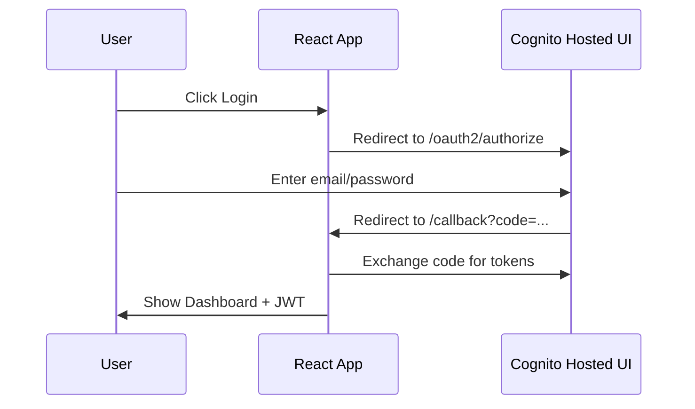

# Cognito Hosted UI — React frontend (beginner guide)

## What you built

| Piece | Meaning |
|-------|---------|
| **Hosted UI** | AWS-hosted login/signup pages (you don't build login forms) |
| **Authorization code** | Secure OAuth flow (`response_type=code`) |
| **ID token (JWT)** | Proof of who logged in; shown on dashboard for learning |
| **sessionStorage** | Browser storage where `oidc-client-ts` keeps tokens after login |

---

## AWS Console — verify settings (do this first)

### Step 1 — Open your User Pool

1. Go to [AWS Console](https://console.aws.amazon.com/)
2. Top-right region: **Asia Pacific (Mumbai) ap-south-1**
3. Search bar: type **Cognito** → open **Amazon Cognito**
4. Click **User pools**
5. Click your pool (ID contains `ap-south-1_dGoMEWNI2`)

### Step 2 — App client callback & logout URLs

1. Left menu → **Applications** → **App clients**
2. Click app client **`6aooj7ob7ika6847eetcq55cn3`** (or your client name)
3. Click **Login pages** tab (or **Edit** under Hosted UI / App client)

**Allowed callback URLs** — add exactly (one per line):

```
http://localhost:5173/callback
```

**Allowed sign-out URLs** — add **without** trailing slash (recommended):

```
http://localhost:5173
```

Optional: also add `http://localhost:5173/` if you already used that elsewhere.

**Default redirect URL** — optional for this project; you can leave it empty or set `http://localhost:5173`.  
Login uses **callback** `http://localhost:5173/callback` (different field).

4. Click **Save changes**

### Step 3 — OAuth settings on the app client

On the same app client page, find **Hosted UI** / **OAuth 2.0** settings:

| Setting | Value |
|---------|--------|
| **Allowed OAuth flows** | ✅ Authorization code grant |
| **Allowed OAuth scopes** | ✅ openid, ✅ email, ✅ profile |
| **Identity providers** | ✅ Cognito user pool |

**Important for SPA:** App client must be **public** (no client secret), or use PKCE.  
If you see a **client secret**, create a new app client **without** secret for this React app.

### Step 4 — Cognito domain (already done)

1. Left menu → **Applications** → **App integration** (or **Domain**)
2. Confirm domain: `ap-south-1dgomewni2.auth.ap-south-1.amazoncognito.com`

---

## Run the frontend

```powershell
cd "c:\yaswanth\BTECH\Sem 6\Cloud Computing\Project\complaint-management-system\frontend"
npm install
npm run dev
```

Open: **http://localhost:5173**

---

## Login test flow

1. Open **http://localhost:5173**
2. Click **Login with Cognito**
3. Browser goes to Cognito Hosted UI (AWS login page)
4. Sign in (or **Sign up** if new user, confirm email if required)
5. Redirect back to **http://localhost:5173/callback** then URL becomes **/**
6. Dashboard shows **email** and **ID token**
7. Click **Logout** → returns to home, login button again

---

## Common Cognito errors

| Error | Fix |
|-------|-----|
| `redirect_uri mismatch` | Callback URL in Cognito must be exactly `http://localhost:5173/callback` |
| `invalid_client` | Wrong Client ID in `frontend/.env` |
| Blank page after login | Check browser console; verify callback URL saved |
| `unauthorized_client` | Enable **Authorization code grant** on app client |
| CORS / network | Use `npm run dev` on port 5173 only |
| Logout doesn't return home / still logged in | Sign-out URL must be **`http://localhost:5173`** (no slash). App uses Cognito `/logout?logout_uri=...` (fixed in code). Restart `npm run dev` after pull. |
| Dashboard still visible after logout | Hard refresh (Ctrl+F5) or clear sessionStorage |

---

## Where tokens are stored

`oidc-client-ts` (used by `react-oidc-context`) stores the user session in **sessionStorage** under keys like:

`oidc.user:https://cognito-idp.ap-south-1.amazonaws.com/ap-south-1_dGoMEWNI2:6aooj7ob7ika6847eetcq55cn3`

To see (Chrome): F12 → **Application** → **Session Storage** → `http://localhost:5173`

Logout clears this storage and redirects through Cognito logout URL.

---

## Login flow (simple)



---

## Environment variables (`frontend/.env`)

| Variable | Your value |
|----------|------------|
| VITE_AWS_REGION | ap-south-1 |
| VITE_COGNITO_USER_POOL_ID | ap-south-1_dGoMEWNI2 |
| VITE_COGNITO_CLIENT_ID | 6aooj7ob7ika6847eetcq55cn3 |
| VITE_COGNITO_DOMAIN | https://ap-south-1dgomewni2.auth.ap-south-1.amazoncognito.com |
| VITE_APP_URL | http://localhost:5173 |
