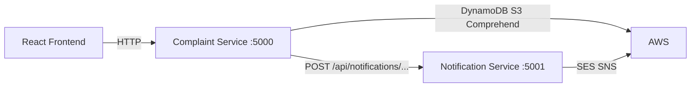

# Microservices architecture (beginner guide)

## What changed

Notifications (SES email + optional SNS) moved from the **Complaint Service** into a separate **Notification Service**.

| Service | Port | Responsibility |
|---------|------|----------------|
| **Complaint Service** (project root) | 5000 | Complaints CRUD, AI, S3 uploads, DynamoDB |
| **Notification Service** (`services/notification-service/`) | 5001 | SES email + SNS alerts |

**Communication:** simple **HTTP POST** (no Kafka, no RabbitMQ).

---

## Architecture diagram



---

## What are microservices? (simple)

A **monolith** = one app does everything.

**Microservices** = split the app into small services, each with **one main job**.

**Why separate notifications?**

- Complaint logic stays focused on data + AI.
- Email/SNS can change without touching complaint code.
- In Kubernetes you can run **two Deployments** and **two Services** — good for demos and evaluation.

**What we did NOT add:** message queues, Kafka, gRPC, service mesh — keeps the project stable and beginner-friendly.

---

## How services talk

After a complaint is **created** or **status updated**, Complaint Service calls:

| Event | HTTP call |
|-------|-----------|
| New complaint | `POST http://notification-service:5001/api/notifications/complaint-created` |
| Status change | `POST http://notification-service:5001/api/notifications/status-updated` |

Body:

```json
{
  "complaint": {
    "complaintId": "...",
    "title": "...",
    "status": "Pending",
    "description": "...",
    "priority": "High",
    ...
  }
}
```

Response:

```json
{ "success": true, "emailSent": true, "snsPublished": false }
```

Calls are **best-effort** — if notification fails, the complaint API still succeeds.

---

## File structure

```
complaint-management-system/
├── src/                          # Complaint Service
│   └── services/
│       └── notificationClient.js # HTTP client → Notification Service
├── services/
│   └── notification-service/     # Notification Service (own package.json)
│       ├── Dockerfile
│       └── src/
├── k8s/
│   ├── deployment.yaml             # complaint
│   ├── notification-deployment.yaml
│   ├── notification-service.yaml
│   └── eks/                        # EKS variants + ECR placeholders
├── docker-compose.yml              # both services locally
└── docs/MICROSERVICES.md           # this file
```

---

## 1. Local development (3 terminals)

**Start here:** [LOCAL_RUN.md](./LOCAL_RUN.md) — full copy-paste steps.

### Which `.env` file? (important)

| Terminal | Service | Folder you `cd` into | `.env` file to edit |
|----------|---------|----------------------|---------------------|
| **1** | Notification | `services\notification-service` | `services\notification-service\.env` |
| **2** | Complaint | project **root** | **root** `.env` (next to `package.json`) |
| **3** | Frontend | `frontend` | `frontend\.env` |

**Terminal 2 uses ROOT `.env` — not the notification folder.**

### Quick commands

**Terminal 1** (notification — start first):

```powershell
cd services\notification-service
npm run dev
```

**Terminal 2** (complaint — root folder):

```powershell
cd <project-root>
npm run dev
```

**Terminal 3** (frontend):

```powershell
cd frontend
npm run dev
```

See [LOCAL_RUN.md](./LOCAL_RUN.md) for exact paths, `.env` contents, and troubleshooting.

---

## 2. Test Notification Service directly (Postman / curl)

```powershell
curl -X POST http://localhost:5001/api/notifications/complaint-created `
  -H "Content-Type: application/json" `
  -d '{"complaint":{"complaintId":"test-1","title":"Test","status":"Pending","description":"Hello","priority":"Medium"}}'
```

**Expected:**

```json
{"success":true,"emailSent":true,"snsPublished":false}
```

---

## 3. Docker Compose (both services)

```powershell
# Notification env
copy services\notification-service\.env.example services\notification-service\.env

# Root .env: DynamoDB, S3, NOTIFICATION_SERVICE_URL is set by compose
docker compose up --build
```

- Complaint API: http://localhost:5000/
- Notification API: http://localhost:5001/

---

## 4. Minikube (Kubernetes)

```powershell
minikube start
.\scripts\apply-minikube.ps1
kubectl get pods
```

**Expected pods:** `complaint-service-...` and `notification-service-...` both **Running**.

```powershell
kubectl port-forward svc/complaint-service 5000:5000
```

Create complaint via frontend or Postman → check notification pod logs:

```powershell
kubectl logs -l app=notification-service --tail=20
```

---

## 5. Amazon EKS

### Step A — Create ECR repo for notification (once)

AWS Console → **ECR** → **Create repository** → name: `notification-service`

Or CLI:

```powershell
aws ecr create-repository --repository-name notification-service --region ap-south-1
```

### Step B — Push both images

```powershell
.\scripts\push-to-ecr.ps1
.\scripts\push-to-ecr.ps1 -Service notification
```

### Step C — Deploy to cluster

```powershell
.\scripts\apply-eks.ps1
kubectl get pods
```

**IAM on EKS node role:**

- Complaint pod: DynamoDB, S3, Comprehend
- Notification pod: SES, SNS (optional)

### Step D — Port forward

```powershell
kubectl port-forward svc/complaint-service 5000:5000
```

---

## How Kubernetes runs multiple services

1. **Deployment** = runs pod(s) for one app.
2. **Service** = stable DNS name inside the cluster.

Complaint pods use:

```text
NOTIFICATION_SERVICE_URL=http://notification-service:5001
```

Kubernetes DNS resolves `notification-service` to the notification Service IP.

---

## Common errors

| Problem | Cause | Fix |
|---------|--------|-----|
| `[notification] Skipped — NOTIFICATION_SERVICE_URL` | URL not set | Set `NOTIFICATION_SERVICE_URL` in `.env` or K8s manifest |
| `[notification] Request failed: fetch failed` | Notification service not running | Start `npm run dev` in `services/notification-service` |
| `emailSent: false` | SES not configured / not verified | Set `SES_FROM_EMAIL` + `ADMIN_EMAIL` in notification `.env`; verify in SES console |
| Complaint works, no email | Only notification service sends mail | Check notification logs, not complaint logs |
| K8s CrashLoop notification | No SES IAM on node role | Attach `AmazonSESFullAccess` to node IAM role (demo) |
| EKS ImagePullBackOff notification | Image not pushed | Run `push-to-ecr.ps1 -Service notification` |

---

## Evaluation talking points

1. **Two microservices** with clear separation of concerns.
2. **HTTP** inter-service communication (simple, observable with logs).
3. **Independent Docker images** and **Kubernetes Deployments/Services**.
4. Same pattern works **locally**, **Docker Compose**, **Minikube**, and **EKS**.

See also: [NOTIFICATIONS.md](./NOTIFICATIONS.md) (SES/SNS setup in AWS Console).
